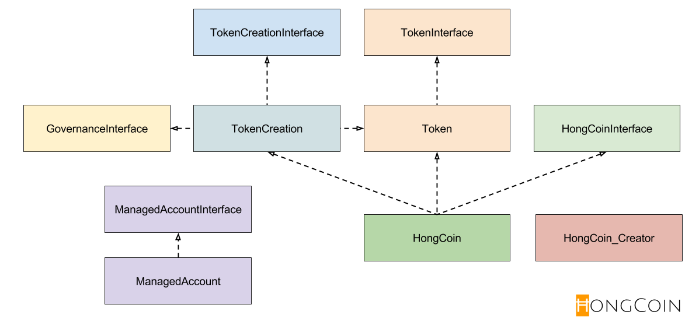
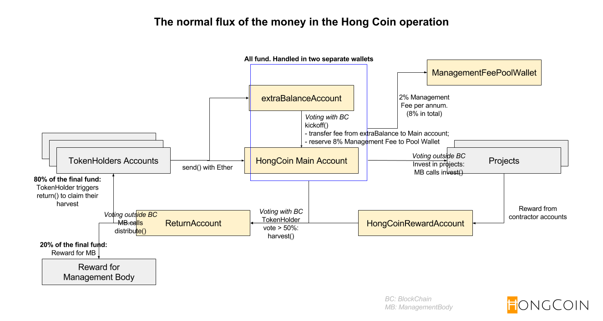

The HONG.  A DO contract
========================
The contract is based on the white paper of http://HongCoin.org, and the collaborative works from community, to create and manage a blockchain-based fund across borders. Some legal and finance related details will be bonded not only in these contracts, but also bounded to ground jurisdiction linking to the management firm.

## About the HONG

### Code Structure

### Flux of the money in the HONG

When the final voting of `harvest()` is approved, all token holders calling will harvest the fund with an amount calculated by:

Total balance in `ReturnAccount` x 80% x (Token owned / Total token issued including ICO and bounty program)

### More details
More details is available at our [Wiki page](https://github.com/hongcoin/DO/wiki).

## How to contribute to the HONG?

### For non-developers

That's easy! Participate in our bounty program to receive free coins.

### For Developers

Fork this repo and submit a pull request! We value your comment and effort spent to make the HONG more reliable and secure.

Join our [Slack channel](http://slack.hongcoin.org) to get the latest progress. We appreciate your contribution and award you the HONG tokens with our bounty program!

## More about Us

### Are you a robot?

We are Man + Machine. :)

### Contact Us

Join our [Slack](http://slack.hongcoin.org) channel to receive the latest updates from us! You can also reach us with the following channels:

Our site: http://www.hongcoin.org

Github: http://github.com/hongcoin

Slack: http://slack.hongcoin.org

Medium: [@hongcoin](https://medium.com/@hongcoin)

Youtube: https://www.youtube.com/channel/UCfPwvDLNFgJ8n70RI65hwKA

Twitter: [@hongcoins](https://twitter.com/hongcoins)

BtcTalk: https://bitcointalk.org/index.php?topic=1563423.0

Welcome new ideas to help advocate the HONG concept and facilitate discussions. Your ideas will be rewarded as well.
