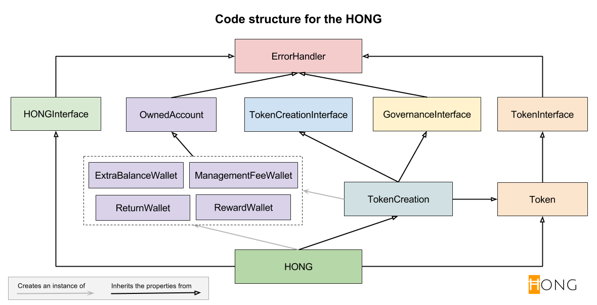

Hong Coin DO contracts
======================
The contract is based on the white paper of HongCoin.org, and the collaborative works from community, to create and manage a blockchain-based fund across borders. Some legal and finance related details will be bonded not only in these contracts, but also bounded to ground jurisdiction linking to the management firm.

### Code Structure

### Flux of the money in Hong Coin

All token holders calling  `harvestWithMyTokens()`  will receive an amount calculated by:

Total balance in `harvestAccount` x 80% x (Token owned / Total token issued including ICO and bounty program)

